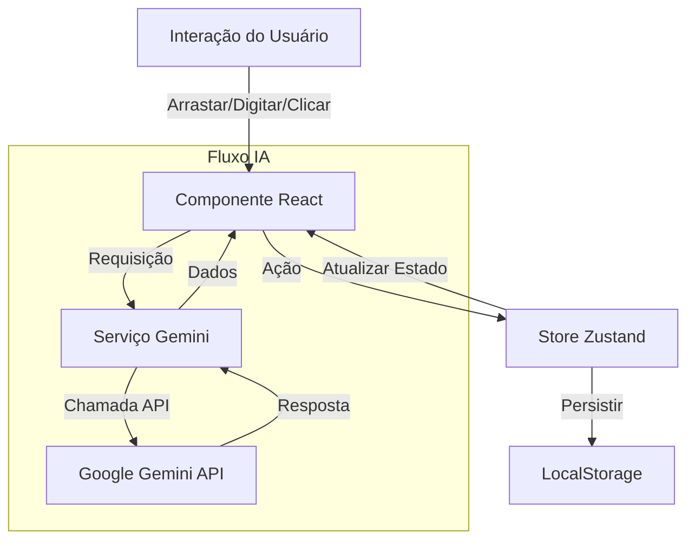

# Documentação de Arquitetura

## 📂 Estrutura de Diretórios

```
src/
├── components/       # Componentes de UI
│   ├── common/       # Componentes genéricos compartilhados (Botão, Modal, etc.)
│   └── ...           # Componentes específicos de funcionalidades
├── hooks/            # Hooks React Personalizados
│   ├── useCanvasControls.ts  # Lógica de Pan/Zoom
│   ├── useSelection.ts       # Lógica de multisseleção
│   └── ...
├── services/         # Integrações de Serviços Externos
│   ├── geminiService.ts      # Integração com Google AI
│   └── ...
├── store/            # Gerenciamento de Estado
│   └── useStore.ts           # Store principal do Zustand
├── types.ts          # Interfaces e Tipos TypeScript
├── utils/            # Funções Auxiliares
└── App.tsx           # Entrada Principal da Aplicação
```

## 🧠 Gerenciamento de Estado (Zustand)
A aplicação usa uma **store centralizada única** (`useStore.ts`) alimentada pelo Zustand.

- **Persistência**: O estado é persistido no `localStorage` para garantir que os dados sobrevivam ao recarregamento da página.
- **Modelo de Dados**:
    - `boards`: Um dicionário de todos os quadros, indexados por ID.
    - `currentBoardId`: O ID do quadro atualmente visível.
    - `items`: Os itens são armazenados dentro da estrutura de dados do quadro.
- **Desfazer/Refazer**: Implementado via pilhas de histórico (`past` e `future`) que capturam o estado do quadro.

## 🎨 Sistema de Tipos de Itens
A tela suporta itens polimórficos. Todos os itens estendem a interface base `BoardItem`.

```typescript
interface BoardItem {
  id: string;
  type: ItemType; // NOTE, IMAGE, TODO, etc.
  x: number;
  y: number;
  w: number;
  h: number;
  zIndex: number;
  // ... propriedades específicas por tipo
}
```

O componente `DraggableItem` atua como o wrapper/controlador para todos os itens, lidando com:
1.  **Arrastar e Soltar**: Atualizando as coordenadas `x, y`.
2.  **Redimensionamento**: Atualizando as dimensões `w, h`.
3.  **Seleção**: Lidando com eventos de clique e shift-clique.
4.  **Renderização**: Alternando entre componentes de conteúdo específicos (ex: `<NoteComponent>`, `<ImageComponent>`) com base no `type`.

## 🖱️ Lógica da Tela (Canvas)
A tela infinita é simulada usando Transformações CSS em uma div contêiner.

- **Panorâmica (Pan)**: Atualiza um estado `translate(x, y)`. Acionado por arrastar com clique do meio ou espaço+arrastar.
- **Zoom**: Atualiza um estado `scale(s)`. Acionado por Ctrl+Scroll ou controles de UI.
- **Conversão de Coordenadas**: Eventos de mouse (coordenadas da tela) são transformados em coordenadas da tela usando o inverso da matriz de transformação atual para garantir que os itens sejam colocados corretamente, independentemente do nível de zoom/pan.

## 🤖 Integração com IA
Os recursos de IA são isolados em `services/geminiService.ts`.

- **Provedor**: Google Gemini API (`gemini-2.5-flash`).
- **Fluxo**:
    1.  Usuário aciona ação (ex: "Gerar Ideias").
    2.  Frontend chama `geminiService`.
    3.  Serviço constrói um prompt e chama a API.
    4.  Resposta é analisada (geralmente esperando JSON) e retornada à UI.
    5.  UI atualiza a store com novos itens.

## 🔄 Fluxo de Dados

